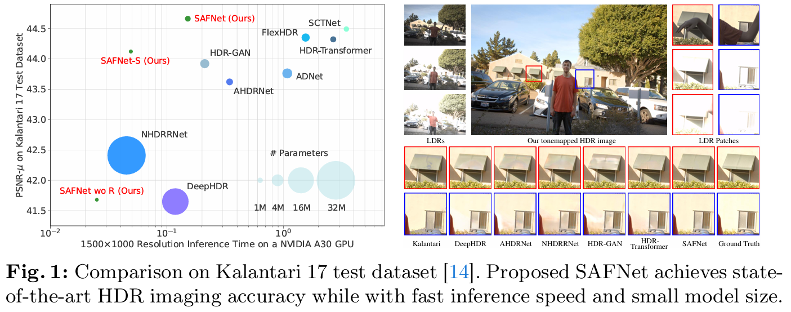
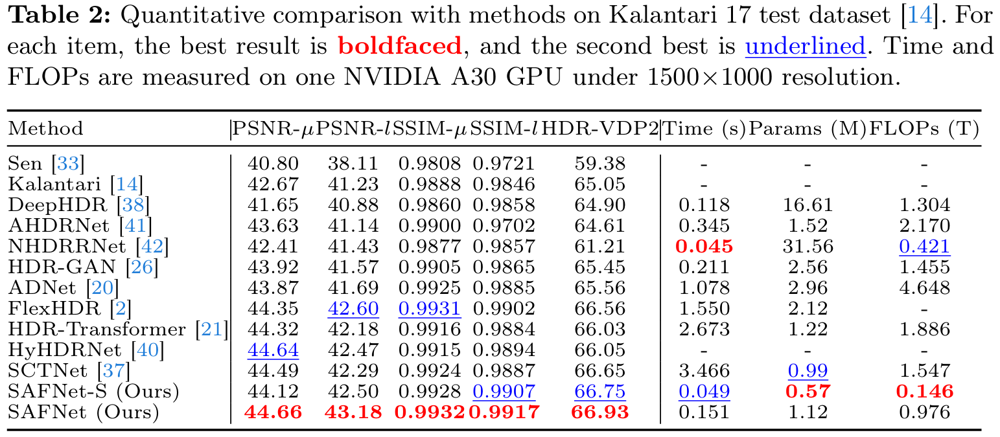
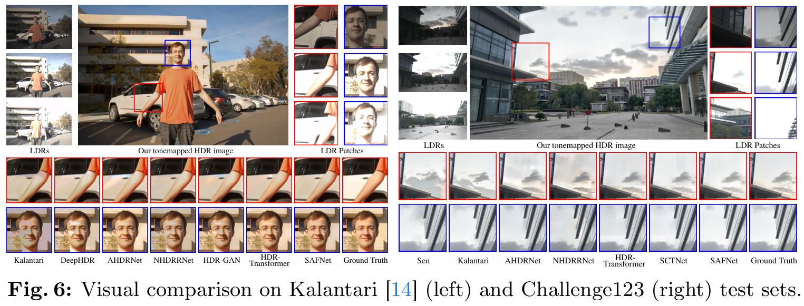

# SAFNet: Selective Alignment Fusion Network for Efficient HDR Imaging
The official PyTorch implementation of SAFNet (ECCV 2024).

Authors: [Lingtong Kong](https://scholar.google.com.hk/citations?user=KKzKc_8AAAAJ&hl=zh-CN), Bo Li, Yike Xiong, Hao Zhang, Hong Gu, Jinwei Chen

## Abstract
Multi-exposure High Dynamic Range (HDR) imaging is a challenging task when facing truncated texture and complex motion. Existing deep learning-based methods have achieved great success by either following the alignment and fusion pipeline or utilizing attention mechanism. However, the large computation cost and inference delay hinder them from deploying on resource limited devices. In this paper, to achieve better efficiency, a novel Selective Alignment Fusion Network (SAFNet) for HDR imaging is proposed. After extracting pyramid features, it jointly refines valuable area masks and cross-exposure motion in selected regions with shared decoders, and then fuses high quality HDR image in an explicit way. This approach can focus the model on finding valuable regions while estimating their easily detectable and meaningful motion. For further detail enhancement, a lightweight refine module is introduced which enjoys privileges from previous optical flow, selection masks and initial prediction. Moreover, to facilitate learning on samples with large motion, a new window partition cropping method is presented during training. Experiments on public and newly developed challenging datasets show that proposed SAFNet not only exceeds previous SOTA competitors quantitatively and qualitatively, but also runs order of magnitude faster.

## Overall Performance

## Quantitative Results

## Qualitative Results

## Challenge123 Dataset
The existing labeled multi-exposure HDR datasets have facilitated research in related fields. However, results of recent methods tend to be saturated due to their limited evaluative ability. We attribute this phenomenon to most of their samples having relatively small motion magnitude between LDR inputs and relatively small saturation ratio of the reference image. To probe the performance gap between different algorithms, we propose a new challenging multi-exposure HDR dataset with enhanced motion range and saturated regions. There are 96 training samples and 27 test samples in our developed Challenge123 dataset.

Dataset download link: [https://huggingface.co/datasets/ltkong218/Challenge123](https://huggingface.co/datasets/ltkong218/Challenge123).

To enhance the applicability of our dataset and promote future research, for each of three content-related moving scenes, we further create under-, middle- and over-exposure LDR images and corresponding HDR image. It means that for each of our 96 training scenes, we have $3 \times 2 \times 1 = 6$ exposure combination for training theoretically, while all experiments on our Challenge123 dataset in this paper adopt under-, middle- and over-exposure LDR images by the time order like previous methods.

Training samples for our experiments in this paper:
<pre><code>./Training/xxx_1/ldr_img_1.tif</code>
<code>./Training/xxx_2/ldr_img_2.tif</code>
<code>./Training/xxx_3/ldr_img_3.tif</code>
<code>./Training/xxx_2/exposure.txt</code>
<code>./Training/xxx_2/hdr_img.hdr</code></pre>

Test samples for our experiments in this paper:
<pre><code>./Test/xxx_1/ldr_img_1.tif</code>
<code>./Test/xxx_2/ldr_img_2.tif</code>
<code>./Test/xxx_3/ldr_img_3.tif</code>
<code>./Test/xxx_2/exposure.txt</code>
<code>./Test/xxx_2/hdr_img.hdr</code></pre>

<code>xxx</code> means the three digits data ID.

## Citation
When using any parts of the Dataset, Software or the Paper in your work, please cite the following paper:
<pre><code>@InProceedings{Kong_2024_ECCV, 
  author={Kong, Lingtong and Li, Bo and Xiong, Yike and Zhang, Hao and Gu, Hong and Chen, Jinwei}, 
  title={SAFNet: Selective Alignment Fusion Network for Efficient HDR Imaging}, 
  booktitle={Proceedings of the European Conference on Computer Vision (ECCV)}, 
  year={2024}
}</code></pre>
